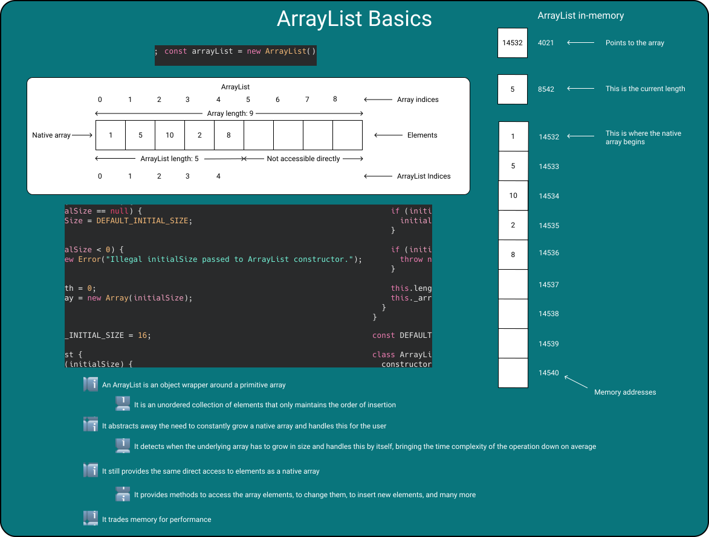
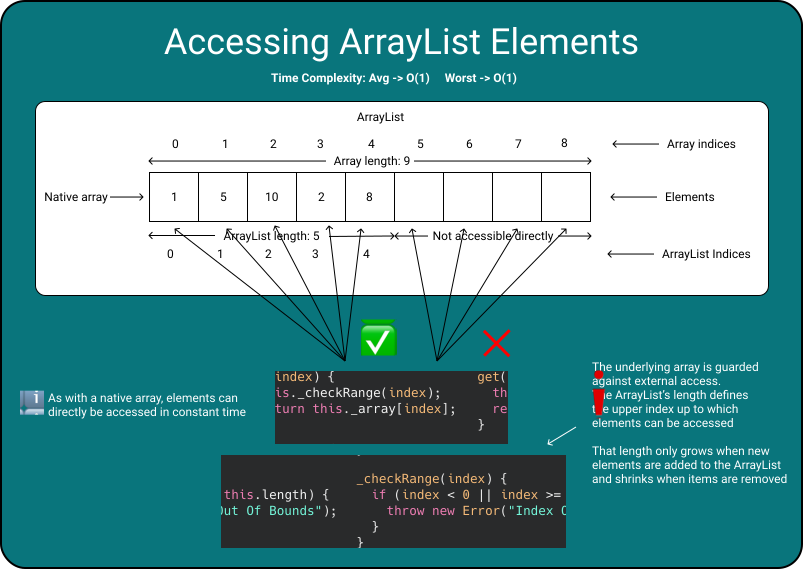
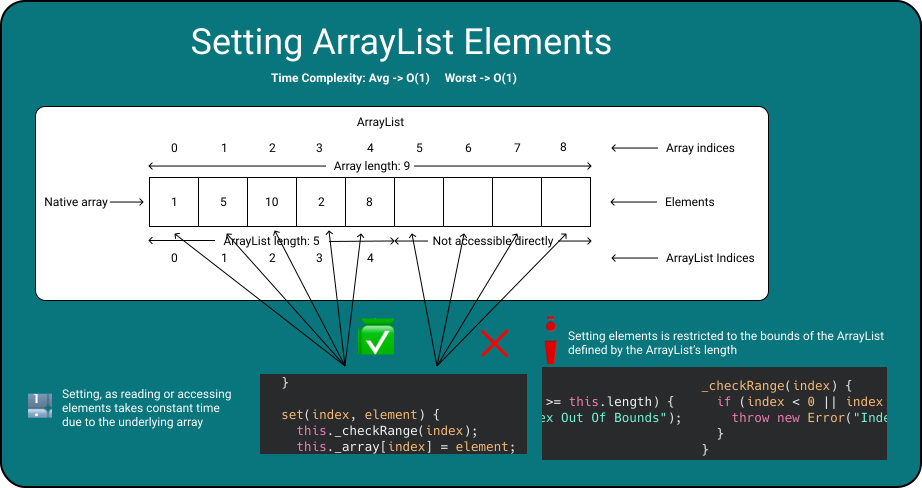
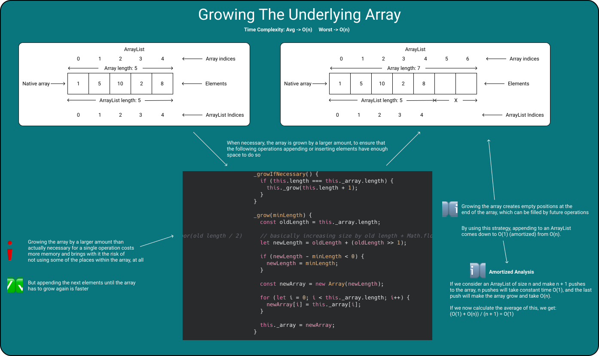
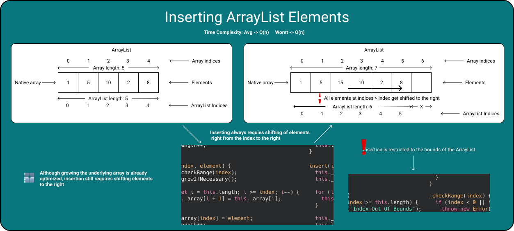
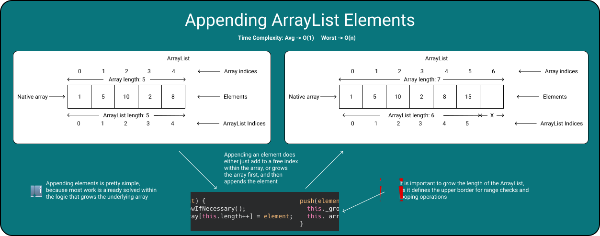
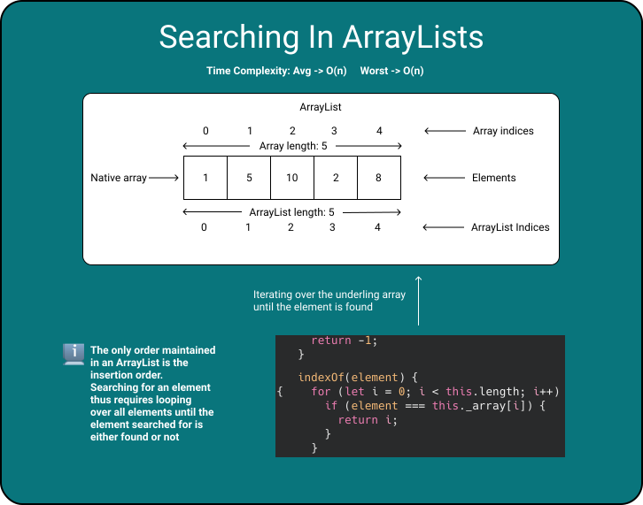
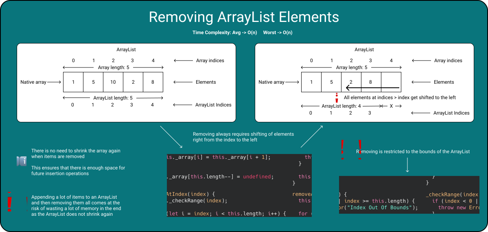
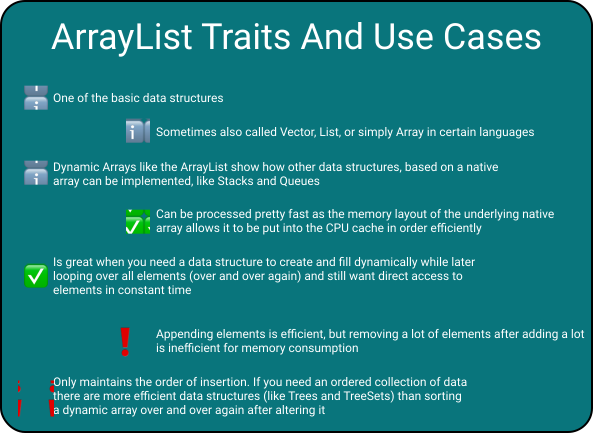

# ArrayList
> [Take me back to Home](../../README.md)

## Basics


An ArrayList is a dynamic array.

It is backed by a native array, but abstracts away its handling with an object as a wrapper.

Most implementations contain a smart logic deciding when to grow the array and optimizing the operation associated with it.

This goes so far as that not all operations which add elements to the ArrayList need to grow the array, but only a few, every now and then.

This optimization leads to the operation being pretty effective. On average the operation can be performed in constant time!

By growing the array by a larger size than actually necessary, there is always some memory allocated, which isn't necessarily used.

Many ArrayList implementations don't shrink the array again. Space that was once allocated stays allocated.

ArrayLists are an example of a data structure that trades memory for performance.

The following is an example of the implementation of an ArrayList without any associated methods:

```JavaScript
class ArrayList {
  constructor(initialSize) {
    if (initialSize == null) {
      initialSize = DEFAULT_INITIAL_SIZE;
    }

    if (initialSize < 0) {
      throw new Error("Illegal initialSize passed to ArrayList constructor.");
    }

    this.length = 0;
    this._array = new Array(initialSize);
  }
}
```

Besides some guard statements, it contains the initialization of a length property, and of the wrapped array.

## Accessing ArrayList Elements


Accessing elements of an ArrayList is usually abstracted away through a method, as you are dealing with an object here.

Instead of a direct access, like with arrays, a method is used, which delegates accesses to the underlying array. To prevent accessing indices which are out of the current bounds, a range check is performed first.

```JavaScript
_checkRange(index) {
  if (index < 0 || index >= this.length) {
    throw new Error("Index Out Of Bounds");
  }
}

get(index) {
  this._checkRange(index);
  return this._array[index];
} 
```


## Setting ArrayList elements


Setting or replacing an element within an ArrayList basically works the same way as accessing it does.

But instead of accessing the element and returning it, after a range check, the element is actually replaced. Once again, the call is delegated to the native array.

```JavaScript
_checkRange(index) {
  if (index < 0 || index >= this.length) {
    throw new Error("Index Out Of Bounds");
  }
}

set(index, element) {
  this._checkRange(index);
  this._array[index] = element;
}
```

## Growing The Underlying Array


Growing the array is the core logic that an ArrayList implements.

This is the logic that is responsible for growing the native array when there is no space left.

Individual implementations may differ and there is no best practice that gives advice on how many elements a dynamic array should grow each time.

Some implementations may grow the array faster by doubling the capacity every time necessary and others, like the one below, only add half of the previous capacity.

No matter the number of elements a dynamic arrays grows, the logic is usualy the same:

1. Calculate the new capacity
2. Create a new array with a larger capacity than the old one
3. Copy over all existing elements
4. Throw the old array away


```JavaScript
_growIfNecessary() {
  if (this.length === this._array.length) {
    this._grow(this.length + 1);
  }
}

_grow(minLength) {
  const oldLength = this._array.length;

  // basically increasing size by old length + Math.floor(old length / 2)
  let newLength = oldLength + (oldLength >> 1);

  if (newLength - minLength < 0) {
    newLength = minLength;
  }

  const newArray = new Array(newLength);

  for (let i = 0; i < this._array.length; i++) {
    newArray[i] = this._array[i];
  }

  this._array = newArray;
}
```

As you can see, an ArrayList keeps a separate length property.

The underlying array may have a capacity of 10 elements resulting in the array having a length of 10, but if only two elements were added to the ArrayList, the ArrayList's length would still be 2.

The length of the ArrayList is used on multiple occasions, including the check if the underlying array actually has to grow.

## Inserting ArrayList Elements


Inserting an element into an ArrayList is a pretty straight-forward operation.

What you basically have to do is:
1. Ensure that the ArrayList has enough capacity for one more element
2. If not
   1. Grow the underlying array
3. Move all elements at an index, greater than the one you want to insert at, one to the right
4. Insert the new element

This boils down to the following code:

```JavaScript
insert(index, element) {
  this._checkRange(index);
  this._growIfNecessary();

  for (let i = this.length; i >= index; i--) {
    this._array[i + 1] = this._array[i];
  }

  this._array[index] = element;
  this.length++;
}
```

As all the other logic is already abstracted away, the only thing you have to implement, is moving all elements to the right, which have an index >= the one you want to insert into at.

And you have to update the length property, as the ArrayList manages one element more now.

## Appending ArrayList Elements


Appending an element to an ArrayList is one of the simpler operations to implement.

Checking if you need to grow the space available for elements and actually replacing the array (and thus growing the underlying array) is already abstracted away.

So what's left is appending the element to the end of the ArrayList, and that's it.

This boils down to the following code:

```JavaScript
push(element) {
  this._growIfNecessary();
  this._array[this.length++] = element;
}
```

Once again, you need to update the length property, to ensure that all logic depending on it still works afterwards.

## Searching In ArrayLists


An ArrayList is only a wrapper around an array.

So an ArrayList shares most of its traits with the array.

An ArrayList doesn't maintain an order other than the order of insertion, and thus what's left for you is doing a sequential search.

A sequential search (or linear search) is the simplest searching algorithm in existence.

The algorithm goes like this:

1. Start at the beginning
2. Check if the element at `index` is the element searched for
3. If so
   1. Return `true`
4. If not, go to `index + 1`
5. If `index` is now greater than the number of elements
   1. return `false`
6. Go to step 2

And this boils down to the following code for a sequential search within an ArrayList with an indexOf function:

```JavaScript
indexOf(element) {
  for (let i = 0; i < this.length; i++) {
    if (element === this._array[i]) {
      return i;
    }
  }
  return -1;
}
```

The only difference here is that the index of an element, if found, is returned, instead of a boolean.

## Removing ArrayList Elements


Removing an element from an ArrayList basically works the same way that removing an element from a native array works.

The difference is that the underlying array isn't shrank, and thus doesn't need to be replaced.

The algorithm goes as follows:

1. Move all elements one place to the left, beginning with the last one, and stopping at the index where the element shall be removed
2. Remove the last element from the ArrayList, which is now one too many

The algorithm boils down to the following code:

```JavaScript
removeAtIndex(index) {
  this._checkRange(index);

  for (let i = index; i < this.length; i++) {
    this._array[i] = this._array[i + 1];
  }

  this._array[this.length--] = undefined;
}
```

As with any operation that has an effect on the amount of elements managed by the ArrayList, you need to update the length property.

## Traits And Use Cases Of ArrayLists


The ArrayList is one of the basic data structures.

It's pretty close to a native array, but adds more flexibility as an object wrapper with a lot of useful methods.

Like arrays, ArrayLists are a pretty fast data structure, which can be attributed to the underlying native array.

As it trades memory for performance, it can be the wrong data structure if you plan to remove a lot of elements after adding many. This would lead to a lot of unused memory.

It's an unordered collection of values. Other than the order of insertion, it doesn't maintain any order. If you need a data structure that holds ordered values, an ArrayList isn't the right one to use.

## The Full Poster

