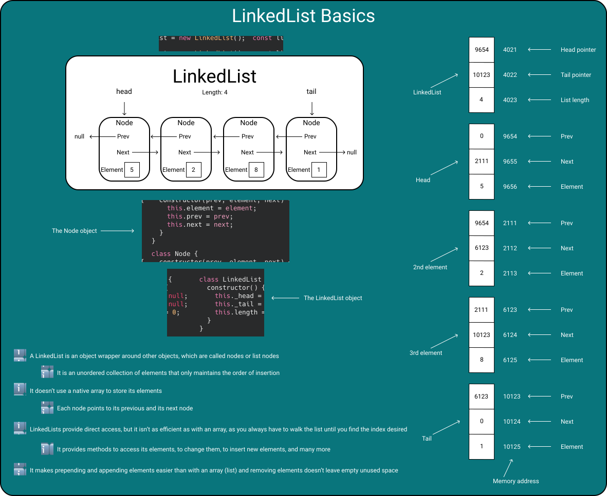
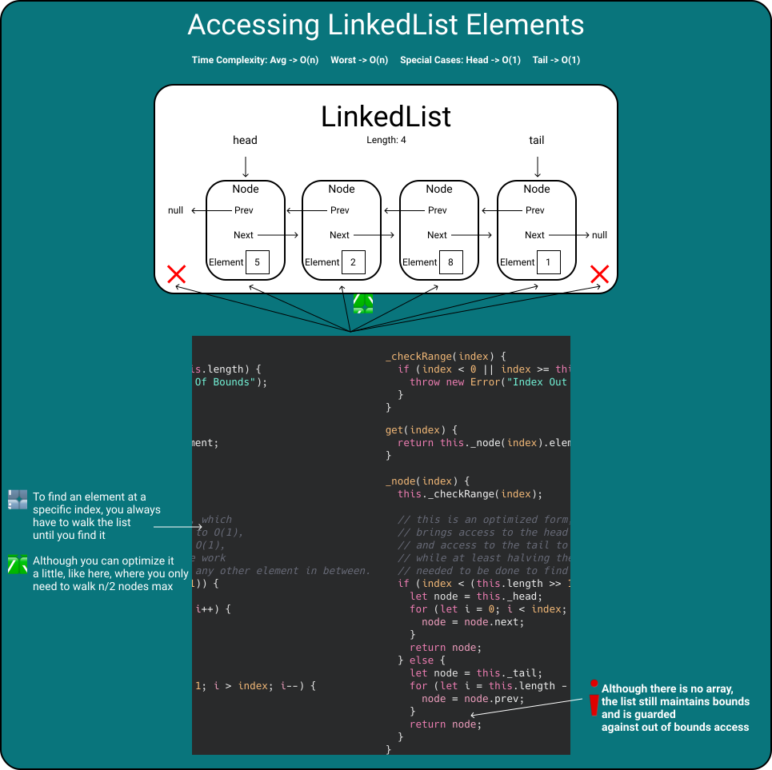
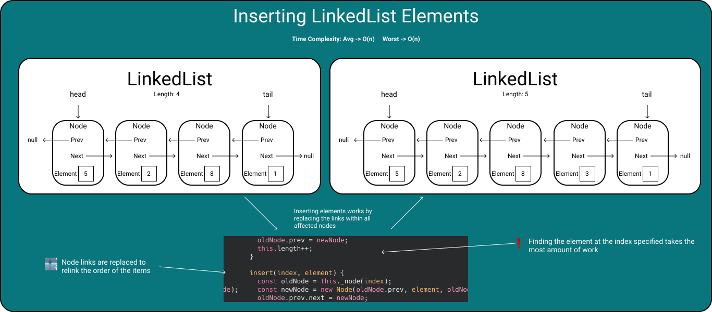
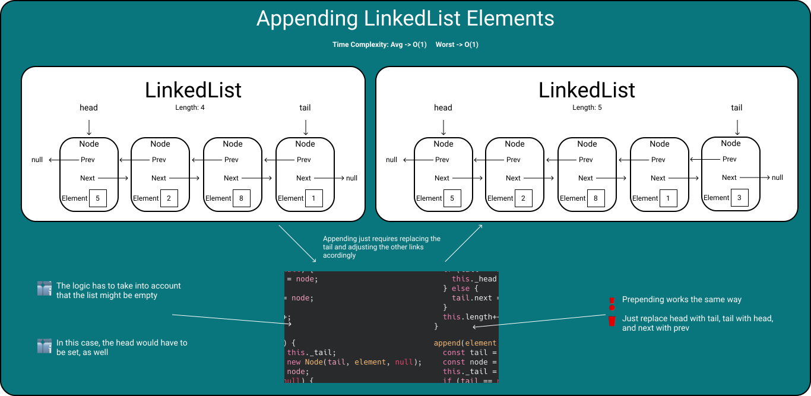
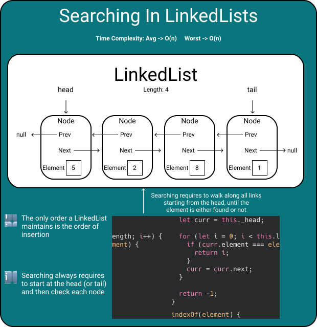
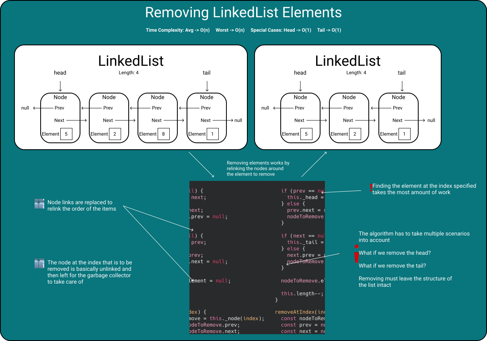
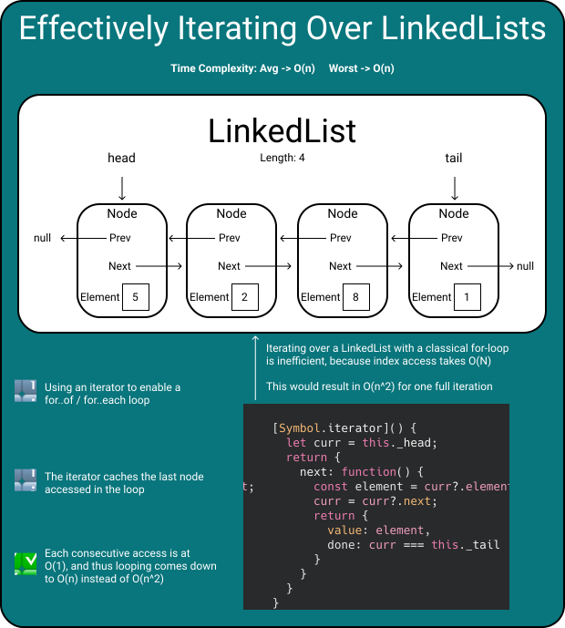
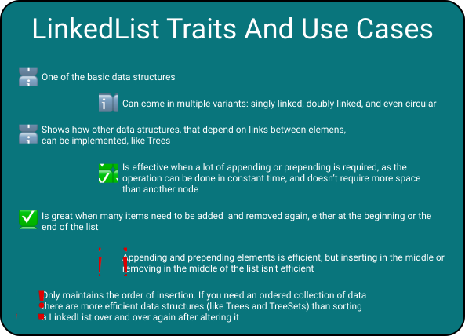

# (Doubly) LinkedList
> [Take me back to Home](../../README.md)

## Basics


A LinkedList is a data structure that is not backed by a native array.

Instead it uses Nodes which carry references to the next (and optionally the previous) Node, effectively creating a list which can be iterated.

```JavaScript
class Node {
  constructor(prev, element, next) {
    this.element = element;
    this.prev = prev;
    this.next = next;
  }
}
```

Additionally, a Node, of course, also contains the element stored within the list.

The LinkedList itself carries references to the head (the first element) and the tail (the last element), as well as a length property.

The length property is an optimization. You could count the number of elements a LinkedList contains everytime a user calls a `length()` or `size()` method, but storing it directly makes asking for the list's size more effective.

```JavaScript
class LinkedList {
constructor() {
  this._head = null;
  this._tail = null;
  this.length = 0;
}
```

One advantage of a LinkedList is that you don't need to grow a native array everytime capacity gets low. You can simply go on appending elements as long as you wish to.
Inserting and deleting elements is also pretty straight-forward, as you only have to rearrange the Node references instead of moving array elements.

A disadvantage is that the references a Node keeps cost memory. And, in addition to that, references can point anywhere on the heap. Elements won't be as aligned as the elements of an array or an ArrayList. Access is thus a little slower.
Another major disadvantage is that random access is costly. Accessing an element in the middle of the list takes some time, because you always have to iterate up to that index first.

## Accessing LinkedList Elements


Accessing LinkedList elements is more complex than for an ArrayList, e.g.

There is no underlying array which provides fast random access. Instead you always have to walk the list up to the index you want to access.

A naive implementation would look like this:

```JavaScript
get(index) {
  let node = this._head;
  for (let i = 0; i < index; i++) {
    node = node.next;
  }
  return node.element;
}
```

It simply walks the LinkedList Nodes.

It starts at the head of the list, and then goes to the next Node, and so on. On the last step of the iteration, it halts at the Node at index - 1 and then walks one Node further, effectively stopping at the Node at the index wanted.

The nested element of that Node is then returned.

You can, however, optimize the operation a little which leads to the following traits:
1. Accessing the head works in constant time
2. Accessing the tail works in constant time
3. Accessing any element within the list only takes n/2 steps
   1. This works by iterating either from the head or the tail, based on the index provided


```JavaScript
_node(index) {
  this._checkRange(index);

  if (index < (this.length >> 1)) {
    let node = this._head;
    for (let i = 0; i < index; i++) {
      node = node.next;
    }
    return node;
  } else {
    let node = this._tail;
    for (let i = this.length - 1; i > index; i--) {
      node = node.prev;
    }
    return node;
  }
}
_checkRange(index) {
  if (index < 0 || index >= this.length) {
    throw new Error("Index Out Of Bounds");
  }
}
get(index) {
  return this._node(index).element;
}
```

You should always do a range check first. This ensures that no one can do operations out of the actual bounds of the LinkedList.

What then follows is the algorithm to actually access the element at the index specified. What it does is checking whether the index lies within the first half of the list or within the other.

The condition may look a little intimidating.
What you see here is a bitshift operation.

```JavaScript
index < (this.length >> 1)
```

All bits are shifted one to the right, which is basically the same as writing:

```JavaScript
Math.floor(this.length / 2);
```

It can sometimes be a little faster than doing a call to `Math.floor` which is a good thing for a commonly used data structure.

Based on the result of the check, you can then either start iterating forward from the head, or backward from the tail.

If the index is the position of the head, the loop directly terminates and yields the head, or vice versa for the tail.

## Setting LinkedList Elements


Setting a LinkedList element basically replaces the element within the Node at a certain index.

The good thing is, as you have seen in the previous explanation for accessing an element, finding a certain node can be made reusable.

In the end, this then boils down to the following code:

```JavaScript
set(index, element) {
  const node = this._node(index);
  node.element = element;
}
```

## Inserting LinkedList Elements


Inserting an element into a LinkedList requires you to do a few things.

There is no native array backing the data structure, so you have to walk the Nodes up to the index where you want to insert an element.

Once again, walking the Nodes up to an index specified is already implemented in a separate method.

This leaves you with the task of inserting the element at the position specified, by linking the element into the lists, in-between the existing nodes.

What you have to do is:
- Walk to the previous element at the index specified
- Create a new Node for the element to insert
- Make the old Node the next Node after the newly inserted one
- Make the next Node of the element that came before the old element the newly created one
- Link the old Node as the next Node of the new one

This results in the following code:

```JavaScript
insert(index, element) {
  const oldNode = this._node(index);
  const newNode = new Node(oldNode.prev, element, oldNode);
  oldNode.prev.next = newNode;
  oldNode.prev = newNode;
  this.length++;
}
```

## Appending LinkedList Elements


Appending elements is pretty straight-forward.

As most implementations always keep at least a reference to the tail, the only thing that usually needs to be done is:

- Take the Node at the tail of the list
- Create a new Node with the element to append
- Set the next reference of the tail Node to the newly created Node
- Replace the tail reference with the newly created Node

```JavaScript
append(element) {
  const tail = this._tail;
  const node = new Node(tail, element, null);
  this._tail = node;
  if (tail == null) {
    this._head = node;
  } else {
    tail.next = node;
  }
  this.length++;
}
```

You have to, of course, take care of the corner case of the List being empty. In this case, the head reference needs to be set, as well.

The same logic can also be altered to implement a prepend method, which enables you to insert elements at the head of the list, instead of the tail, and which also works with empty lists.

```JavaScript
prepend(element) {
  const head = this._head;
  const node = new Node(null, element, head);
  this._head = node;
  if (head == null) {
    this._tail = node;
  } else {
    head.prev = node;
  }
  this.length++;
}
```

## Searching In LinkedLists


Searching in LinkedList can only be solved with a sequential search.

There is no order maintained, other than the order of insertion, and there is no logic that automatically orders the elements on insertion.

The only solution that's left to you in this case is walking all Nodes, starting from the head, comparing each Node's element with the element searched for, until you either find it or not.

An implementation of an `indexOf` method would look like below:

```JavaScript
indexOf(element) {
  let curr = this._head;

  for (let i = 0; i < this.length; i++) {
    if (curr.element === element) {
      return i;
    }
    curr = curr.next;
  }

  return -1;
}
```

## Removing LinkedList Elements


Removing elements from a LinkedList is basically the reversed operation of inserting an element.

Instead of linking an element in, you just link it out.

What you have to do is:

- Walk to the Node of the element which you want to remove
- The next reference of its previous element should now point to its next element
- The previous reference of its next element should now point to its previous element

Once again, you have to take into account potential corner cases, like the last element being removed, or the first one.

This boils down to the following implementation:

```JavaScript
removeAtIndex(index) {
  const nodeToRemove = this._node(index);
  const prev = nodeToRemove.prev;
  const next = nodeToRemove.next;
  
  if (prev == null) {
    this._head = next;
  } else {
    prev.next = next;
    nodeToRemove.prev = null;
  }

  if (next == null) {
    this._tail = prev;
  } else {
    next.prev = prev;
    nodeToRemove.next = null;
  }

  nodeToRemove.element = null;

  this.length--;
}
```

## Effectively Iterating Over LinkedLists


As you may have noticed with nearly all of the implementations presented here, whatever you do, you always have to walk the nodes up to a certain point.

One common operation when working with certain data structures is iterating over all elements, transforming them, e.g.

Take a look at the following code:
```JavaScript
function iterateOver(list) {
  for (let i = 0; i < list.length; i++) {
    console.log(list.get(i));
  }
}
```

Every time you do an index-based access, the algorithm either starts at the head or the tail and then walks a few Nodes up to the index you want to access.

As you can imagine, this becomes pretty inefficient.

Gladly for you, there exists a concept, called iterator, which can help in optimizing the operation up to the point where it becomes linear again.

Instead of walking the Nodes each time you do an access, you could cache the current Node, return its element, and then walk to the next Node.

JavaScript has a special Symbol for that, `Symbol.iterator` which enables you to do a for..of loop with an object.

The implementation looks like this:

```JavaScript
[Symbol.iterator]() {
  let curr = this._head;
  return {
    next: function() {
      const element = curr?.element;
      curr = curr?.next;
      return {
        value: element,
        done: curr === this._tail
      }
    }
  }
}
```

It basically returns an object, which the runtime uses to retrieve the next element, and to check whether the iteration should stop.

With this in place, you can now iterate over your list like this, in linear time:

```JavaScript
function iterateOver(list) {
  for (const current of list) {
    console.log(current);
  }
}
```

## Traits And Use Cases Of LinkedLists


A LinkedList is one of the basic data structures.

It can come in a lot of variants, like:

- Singly Linked List
- Doubly Linked List
- Circular Linked List


It's the best data structure to use if you want to add a lot of elements, and also remove a lot of elements from it, because other than an ArrayList, a LinkedList simply shrinks again, due to its nature.

If you want to insert or remove a lot of elements from the middle of the list, however, operations won't be as effective.

The LinkedList is an unordered collection, it doesn't maintain any order other than the order of insertion. If you want a data structure that keeps a certain order for you automatically, there are ones better suited to that requirement.

## Full Poster

